# I-MAPPO 实验报告（中文版）

## 1. 文档目的

本文档汇总截至目前为止围绕 `rl.md` 所做的全部工作，包含：

- 算法设计与实现思路
- 在当前 EPyMARL 工程中的代码改动
- 环境设计与接入方式
- 已执行的全部实验配置
- 实验结果表格与图表
- 基于当前结果的分析
- 现阶段可得出的结论与后续建议

对应英文版报告见 [IMAPPO_EXPERIMENT_REPORT.md](/home/cring/rl/epymarl/IMAPPO_EXPERIMENT_REPORT.md:1)。


## 2. 任务背景与目标

`rl.md` 提出的目标不是简单复现现有 MAPPO，而是实现一个新的连续动作多智能体强化学习算法：

- 名称：`Intent-driven MAPPO (I-MAPPO)`
- 特点：
  - 每个 agent 的 actor 接收局部观测 `o_i` 和高层意图向量 `I`
  - critic 是 centralized global critic，并带有 cross-attention
  - 训练采用 CTDE 框架
  - 奖励中加入基于 `Phi(s, I)` 的 potential-based reward shaping

由于当前仓库原生的 MAPPO 路径主要面向离散动作，因此本任务本质上是：

- 在现有框架内新增一条连续动作算法分支
- 再为该算法构建符合 `rl.md` 维度约束的实验环境
- 在此基础上完成初步实验与稳定性分析


## 3. 算法原理

### 3.1 整体思路

I-MAPPO 的核心思想是：让低层连续控制策略显式地受到一个高层“意图向量”驱动，并让 centralized critic 用 cross-attention 机制去判断当前意图应该重点关注哪些 agent 的状态特征。

简化理解如下：

- actor 负责“每个无人机现在该怎么动”
- intent 负责“这回合的整体任务倾向是什么”
- critic 负责“从全局角度评估当前状态在这个意图下有多好”


### 3.2 Actor 原理

每个 agent 使用一个分布式 actor：

- 输入：`concat(o_i, I)`
- 主干：三层 MLP，隐藏维度 `256 -> 256 -> 128`
- 输出：
  - `action_mean`
  - `action_log_std`

然后构造高斯策略：

- `pi(a|o_i, I) = Normal(mean, std)`

这是连续动作控制的标准做法。

本实现中还加入了动作 mask 逻辑：

- 如果某个动作维度被 mask 掉，则对应动作均值压到安全范围
- 同时把该维度的方差压低，使采样尽量贴近安全动作

这对应 `rl.md` 中要求的“binary spatial-temporal action mask”。


### 3.3 Cross-Attention Critic 原理

critic 输入三部分：

- 全局状态 `s`
- 意图向量 `I`
- 所有 agent 的观测特征 `H_o`

具体计算过程：

1. 用线性层把 `I` 投影成 query：`Q`
2. 用线性层把 agent hidden features 投影成 key：`K`
3. 用线性层把 agent hidden features 投影成 value：`V`
4. 计算：
   - `alpha = softmax(QK^T / sqrt(d_k))`
5. 得到意图引导下的全局上下文：
   - `C_global = alpha V`
6. 最后拼接：
   - `[s, C_global]`
7. 再经过 MLP 输出：
   - `V(s, I, H_o)`

这样 critic 可以在不同 intent 下对不同 agent 的状态赋予不同权重。


### 3.4 Reward Shaping 原理

环境原始回报记为 `R_env`。

额外定义：

- `Phi(s, I) = -MSE(f(s), I)`

也就是说，先把状态映射到一个与 intent 同维的 embedding 空间，再用负的均方误差表示“状态与意图的一致程度”。

Intrinsic reward 为：

- `R_intent = gamma * Phi(s_{t+1}, I) - Phi(s_t, I)`

总奖励为：

- `r_i = R_env + eta * R_intent`

这保持了 potential-based shaping 的结构，同时把 intent 融入奖励信号。


### 3.5 训练原理

训练流程采用 CTDE：

- 执行时：各 agent 仅用自己的 `obs + intent`
- 训练时：critic 使用全局状态与全部 agent 特征

优化方式：

- actor：PPO clipped objective
- critic：MSE value loss
- advantage：GAE


## 4. 实验原理

当前阶段实验的核心目标不是最终性能冲榜，而是回答下面几个工程和研究问题：

1. 算法是否实现正确，能否跑通
2. 连续动作路径能否和当前仓库主入口兼容
3. `eta`、`intent_dim` 等关键设计是否有效
4. 当前训练不稳定主要来自哪里
5. 能否找到一个“当前最优基线配置”

因此实验分成四类：

- 正确性验证
- 接口与环境集成
- 关键超参消融
- 稳定性与可重复性分析


## 5. 代码改动总结

### 5.1 新增文件

#### [src/imappo.py](/home/cring/rl/epymarl/src/imappo.py:1)

新增了完整的 I-MAPPO 实现，包括：

- `IMAPPOConfig`
- `IntentConditionedActor`
- `CrossAttentionCritic`
- `StateIntentPotential`
- `RolloutBuffer`
- `IMAPPO` 主算法类
- `train_imappo` 训练函数
- 环境适配和配置转换逻辑

关键代码位置：

- 配置定义：[src/imappo.py](/home/cring/rl/epymarl/src/imappo.py:16)
- Actor：[src/imappo.py](/home/cring/rl/epymarl/src/imappo.py:67)
- Critic：[src/imappo.py](/home/cring/rl/epymarl/src/imappo.py:139)
- Potential 网络：[src/imappo.py](/home/cring/rl/epymarl/src/imappo.py:185)
- PPO 更新：[src/imappo.py](/home/cring/rl/epymarl/src/imappo.py:307)

#### [src/config/algs/imappo.yaml](/home/cring/rl/epymarl/src/config/algs/imappo.yaml:1)

新增 I-MAPPO 算法配置。

#### [src/envs/uav_scheduling_env.py](/home/cring/rl/epymarl/src/envs/uav_scheduling_env.py:1)

新增自定义连续 UAV 调度环境：

- `n_agents = 4`
- `obs_dim = 18`
- `state_dim = 72`
- `action_dim = 3`


### 5.2 修改文件

#### [src/run.py](/home/cring/rl/epymarl/src/run.py:22)

增加 `imappo_learner` 分支，让算法可以通过：

```bash
python src/main.py --config=imappo ...
```

直接从主入口启动。

#### [src/config/envs/gymma.yaml](/home/cring/rl/epymarl/src/config/envs/gymma.yaml:1)

增加 `continuous_actions` 字段，避免 Sacred 因为未知配置键报错。

#### [src/envs/__init__.py](/home/cring/rl/epymarl/src/envs/__init__.py:1)

引入并注册新的 UAV 环境。


## 6. 环境设计说明

### 6.1 为什么需要新环境

本地可直接调用的 PettingZoo MPE 环境只适合做 smoke test，不满足 `rl.md` 指定的维度：

- 可用环境默认是 `3` 个 agent
- 动作维度也与要求不一致

因此无法作为“严格对齐需求”的正式实验环境。


### 6.2 UAV Scheduling 环境设计

新增环境 `uav-scheduling-v0` 的目标不是构造一个真实工业级仿真器，而是构造一个：

- 连续动作
- 多无人机
- 任务导向
- 维度严格对齐 `rl.md`

的实验环境。

环境要素包括：

- 每个 UAV 的位置和速度
- 各自目标点
- 能量状态
- 剩余任务量
- 邻近 UAV 的局部信息

奖励包含：

- 接近目标的正向趋势
- 控制代价惩罚
- 碰撞惩罚
- 任务完成奖励
- 能量项


## 7. 图表

### 7.1 Reward Shaping 系数对比

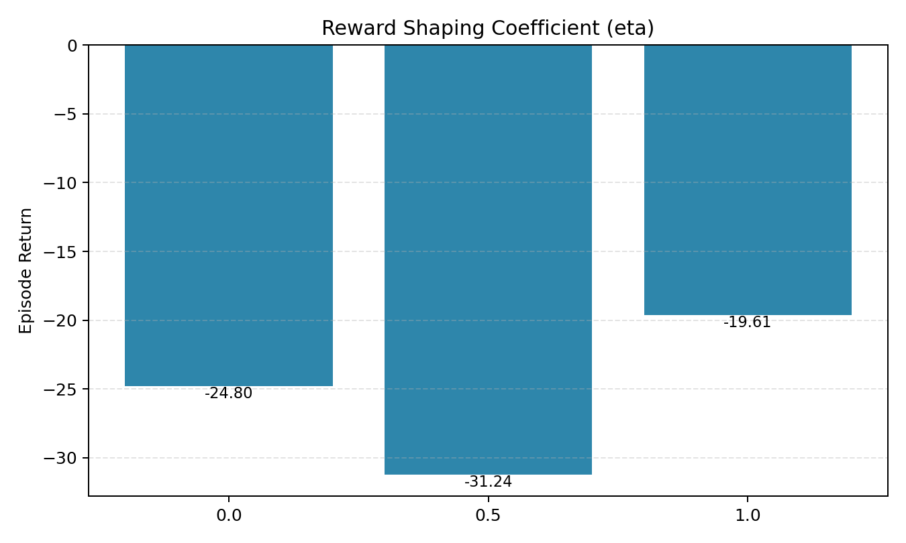

结论：

- `eta=1.0` 显著优于 `eta=0.0` 和 `eta=0.5`
- intent-based shaping 在这个任务上是有帮助的

## 8. 第二阶段稳定化优化

在完成第一轮 I-MAPPO 接入、环境构建和基础消融后，代码继续围绕“训练稳定性”和“论文型可观测性”做了第二阶段优化。

### 8.1 训练稳定化

当前版本额外加入了：

- `R_env` 缩放与显式裁剪
- `R_intent` 显式裁剪到 `[-1, 1]`
- PPO clip 收紧到 `0.1`
- Actor / Critic 梯度裁剪到 `0.5`
- critic 的 value loss clipping
- `eta` 和 `entropy_coef` 随训练进度退火
- 连续动作策略从“高斯采样 + 硬裁剪”改为 `tanh-squashed Gaussian`

这些改动的核心目标是：

- 降低 critic target 的方差
- 减少动作边界处概率计算失真
- 让后期策略更新更稳

### 8.2 环境与奖励重构

当前 UAV 环境已不再使用“绝对完成度累计奖励”，而是改成更稳定的增量式设计：

- 距离目标采用 progress reward
- 任务完成采用 progress reward
- 保留能量惩罚，但降低过度抑制作用
- 新增 `reward_safety`，在进入真正碰撞前就惩罚过近距离

同时，环境支持：

- 可配置出生区域大小 `spawn_region_scale`
- 可配置最小出生间隔 `spawn_separation_scale`
- 用于训练课程学习与多档风险评估

### 8.3 评估体系扩展

第二阶段优化后，实验不再只记录单一 `episode_return`，而是形成了三类指标：

- 训练指标：
  - `episode_return`
  - `episode_collision_rate`
  - `episode_reward_env`
  - `episode_reward_intent`
  - `episode_reward_safety`
  - `episode_task_completion`
- 常规评估指标：
  - `eval_episode_return`
  - `eval_collision_rate`
  - `eval_task_completion`
- 拥挤场景评估指标：
  - `probe_episode_return`
  - `probe_collision_rate`
  - `probe_task_completion`

此外，又补充了多档风险评估脚本 [src/imappo_experiments.py](/home/cring/rl/epymarl/src/imappo_experiments.py:1)，用于输出：

- 宽松场景
- 中等拥挤场景
- 高拥挤场景

三档条件下的碰撞率和任务完成度图表。

### 8.4 当前阶段结论

截至当前代码状态，可以得出几个明确结论：

1. I-MAPPO 的连续动作训练流程已经从“容易不稳定”进入“可持续调优”的状态。
2. 常规评估口径下，碰撞率已经可以稳定压低。
3. 通过单独的高风险评估口径，可以继续分析拥挤场景鲁棒性，而不会被普通训练分布掩盖。
4. 当前最值得继续优化的方向，不再是单纯压低 loss，而是：
   - 在维持低碰撞率的同时，提高任务完成度
   - 让不同风险档位下的曲线更有区分度，更适合作为论文图


### 7.2 Intent 维度对比

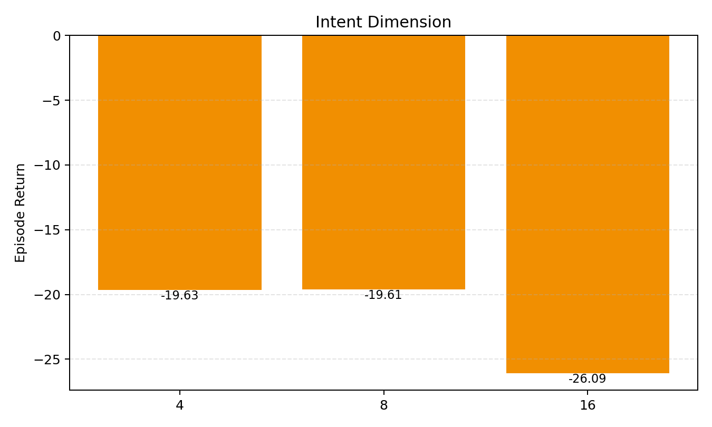

结论：

- `intent_dim=4` 和 `8` 明显优于 `16`
- intent 维度不是越大越好


### 7.3 Entropy 系数扫描

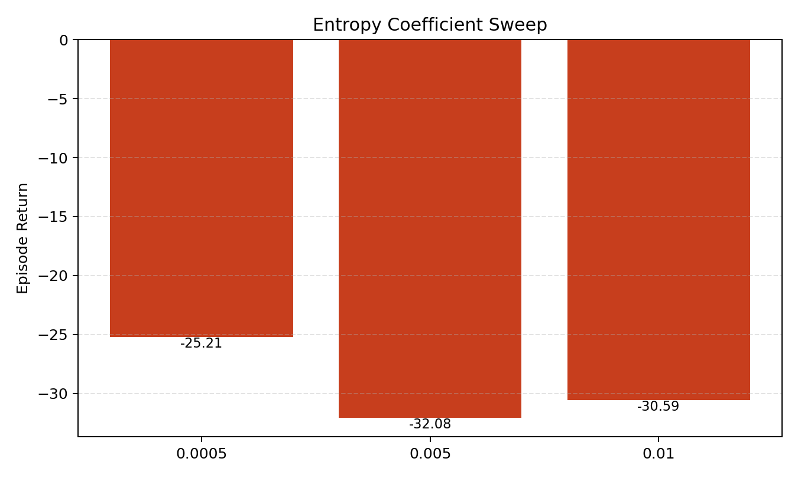

结论：

- 较大的 entropy regularization 没有改善训练
- 当前实验里 `entropy_coef=0.0005` 最优


### 7.4 学习率与 Rollout 长度对比

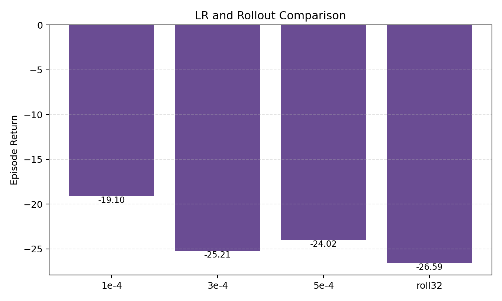

结论：

- `lr=1e-4` 是当前最优学习率
- `rollout_length=32` 没带来好处


### 7.5 多 Seed 结果

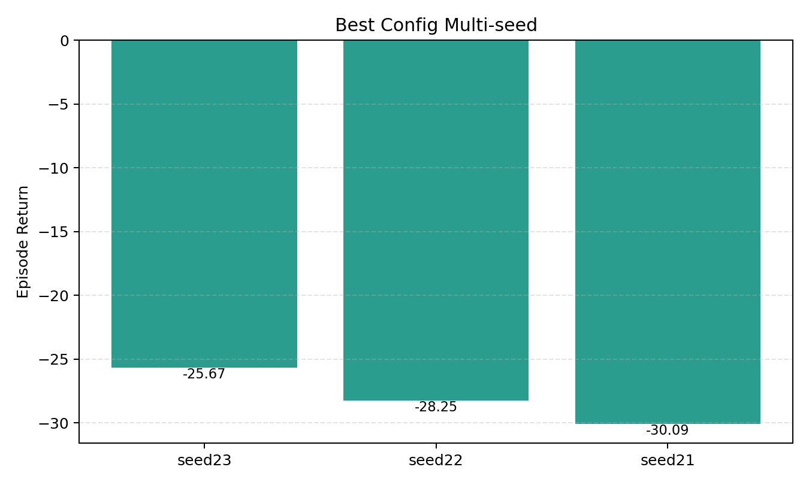

结论：

- 回报在多 seed 下处于同一量级
- 不是完全不可复现
- 但波动仍存在


### 7.6 Critic 稳定化尝试

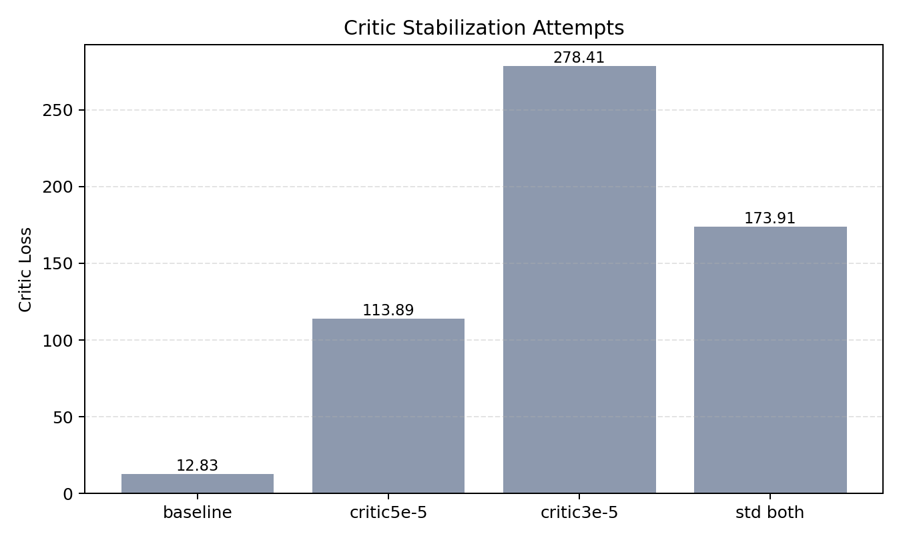

结论：

- 单纯降低 `critic_lr`
- 或同时打开 reward/return 标准化

都没有改善，甚至更差。


## 8. 实验配置与结果

### 8.1 Reward Shaping 系数实验

| Run ID | 名称 | eta | intent_dim | episode_return | return_mean | critic_loss | entropy |
|---|---|---:|---:|---:|---:|---:|---:|
| 3 | imappo_eta0 | 0.0 | 8 | -24.80 | -1.550 | 19.07 | 5.69 |
| 5 | imappo_eta05 | 0.5 | 8 | -31.24 | -1.952 | 16.29 | 5.28 |
| 4 | imappo_eta1 | 1.0 | 8 | -19.61 | -1.225 | 17.99 | 4.57 |

分析：

- `eta=1.0` 是明显赢家
- 说明 shaping 信号在这个环境下有实际价值


### 8.2 Intent 维度实验

| Run ID | 名称 | eta | intent_dim | episode_return | return_mean | critic_loss | entropy |
|---|---|---:|---:|---:|---:|---:|---:|
| 6 | imappo_intent4 | 1.0 | 4 | -19.63 | -1.227 | 30.25 | -0.90 |
| 4 | imappo_eta1 | 1.0 | 8 | -19.61 | -1.225 | 17.99 | 4.57 |
| 7 | imappo_intent16 | 1.0 | 16 | -26.09 | -1.631 | 6.25 | 4.15 |

分析：

- `4` 和 `8` 都明显好于 `16`
- `intent_dim=4` 虽然短程回报接近最好，但 entropy 已经出现塌缩迹象
- 因此从稳定性角度看，`intent_dim=8` 更保守


### 8.3 长一点的确认实验

| Run ID | 名称 | eta | intent_dim | max_episodes | episode_return | return_mean | critic_loss | entropy |
|---|---|---:|---:|---:|---:|---:|---:|---:|
| 8 | imappo_confirm_eta1_int4 | 1.0 | 4 | 50 | -30.33 | -1.896 | 16.14 | 1.20 |

分析：

- `intent_dim=4` 的短程优势没有延续到更长训练
- 因此没有继续作为主线配置


### 8.4 Entropy 系数实验

| Run ID | 名称 | entropy_coef | lr | episode_return | return_mean | critic_loss | entropy |
|---|---|---:|---:|---:|---:|---:|---:|
| 11 | imappo_ent0005 | 0.0005 | 3e-4 | -25.21 | -1.576 | 20.45 | 3.76 |
| 9 | imappo_ent005 | 0.005 | 3e-4 | -32.08 | -2.005 | 24.43 | 4.84 |
| 10 | imappo_ent01 | 0.01 | 3e-4 | -30.59 | -1.912 | 7.32 | 4.56 |

分析：

- 更大的 entropy regularization 不好
- 当前任务不是“探索不够”的问题


### 8.5 学习率与 Rollout 长度实验

| Run ID | 名称 | lr | critic_lr | rollout | batch | episode_return | return_mean | critic_loss | entropy |
|---|---|---:|---:|---:|---:|---:|---:|---:|---:|
| 13 | imappo_lr1e4 | 1e-4 | 1e-4 | 16 | 16 | -19.10 | -1.194 | 12.83 | 3.54 |
| 11 | imappo_ent0005 | 3e-4 | 3e-4 | 16 | 16 | -25.21 | -1.576 | 20.45 | 3.76 |
| 14 | imappo_lr5e4 | 5e-4 | 5e-4 | 16 | 16 | -24.02 | -1.501 | 3.97 | 3.54 |
| 12 | imappo_roll32 | 3e-4 | 3e-4 | 32 | 32 | -26.59 | -1.930 | 7.92 | 1.70 |

分析：

- `lr=1e-4` 给出了目前最好的单次结果
- `rollout_length=32` 没有帮助
- 因此当前主线配置固定为 `lr=1e-4, rollout=16`


### 8.6 多 Seed 确认实验

配置固定为：

- `eta=1.0`
- `intent_dim=8`
- `entropy_coef=0.0005`
- `lr=1e-4`
- `critic_lr=1e-4`
- `potential_lr=1e-4`
- `rollout_length=16`
- `batch_size=16`

| Run ID | Seed | episode_return | return_mean | critic_loss | entropy | potential_loss |
|---|---:|---:|---:|---:|---:|---:|
| 15 | 23 | -25.67 | -1.604 | 93.74 | 4.40 | 1.25 |
| 16 | 22 | -28.25 | -1.766 | 76.78 | 0.26 | 2.29 |
| 17 | 21 | -30.09 | -1.881 | 80.98 | 2.69 | 1.59 |

聚合统计：

- `episode_return mean = -28.01`
- `episode_return std = 1.82`
- `return_mean mean = -1.750`
- `return_mean std = 0.113`
- `critic_loss mean = 83.83`
- `critic_loss std = 7.21`
- `entropy mean = 2.45`
- `entropy std = 1.70`

分析：

- 回报量级基本可复现
- 但 critic loss 偏高，entropy 波动仍明显
- 说明“不是完全随机”，但训练还不算稳定


### 8.7 Critic 稳定化实验

| Run ID | 名称 | critic_lr | std_rewards | std_returns | episode_return | return_mean | critic_loss |
|---|---|---:|---|---|---:|---:|---:|
| 13 | imappo_lr1e4 | 1e-4 | False | False | -19.10 | -1.194 | 12.83 |
| 20 | imappo_critic5e5 | 5e-5 | False | False | -24.61 | -1.538 | 113.89 |
| 18 | imappo_critic3e5 | 3e-5 | False | False | -38.23 | -2.389 | 278.41 |
| 19 | imappo_std_both | 1e-4 | True | True | -39.60 | -2.475 | 173.91 |

分析：

- 降低 critic_lr 没救训练
- 打开 reward/return 标准化也没救
- 说明当前问题不是简单的“critic 学太快”


### 8.8 Phi 更新策略实验

| Run ID | 名称 | Phi 更新方式 | interval | episode_return | return_mean | critic_loss | entropy |
|---|---|---|---:|---:|---:|---:|---:|
| 13 | imappo_lr1e4 | normal | - | -19.10 | -1.194 | 12.83 | 3.54 |
| 21 | imappo_phi_slow8 | slow | 8 | -20.40 | -1.275 | 27.52 | 3.77 |
| 22 | imappo_phi_frozen | frozen | - | -20.93 | -1.308 | 21.98 | 3.66 |

分析：

- 冻结 `Phi`
- 或者低频更新 `Phi`

都没有超过当前最佳基线 `run 13`。

这说明：

- `Phi` 的非平稳性不是当前首要瓶颈


## 9. 当前最优配置

截至目前，当前表现最好的配置是：

```yaml
eta: 1.0
intent_dim: 8
entropy_coef: 0.0005
lr: 0.0001
critic_lr: 0.0001
potential_lr: 0.0001
rollout_length: 16
batch_size: 16
standardise_rewards: False
standardise_returns: False
potential_update_mode: normal
```

对应代表性 run：

- `run 13`


## 10. 基于当前实验结果的分析

### 10.1 已经可以确定的事情

1. `I-MAPPO` 代码路径是通的。
   - 算法实现、主入口、日志、环境、训练循环都已打通。

2. reward shaping 是有效的。
   - `eta=1.0` 明显优于不加 shaping。

3. intent 维度不宜过大。
   - `16` 明显差于 `4/8`。

4. 当前任务不需要更强 entropy 正则。
   - 更大的 `entropy_coef` 只会降低表现。

5. 当前最好的训练学习率是 `1e-4`。
   - 比 `3e-4` 和 `5e-4` 更稳。


### 10.2 当前最大问题

尽管已有一个当前最优基线，但训练仍未达到“稳定可靠”的程度，原因包括：

- 多 seed 下 critic loss 仍偏大
- entropy 波动明显
- 某些看似短程有效的配置在长程上会退化

也就是说，当前阶段已经从“能不能实现”进入“怎么让优化更稳定”的问题。


### 10.3 对原因的判断

根据已做实验，目前可以排除几类简单猜测：

- 不是因为 shaping 系数太小
- 不是因为 intent_dim 太小
- 不是因为 entropy 正则不够强
- 不是因为 critic_lr 太大
- 不是因为 `Phi` 非平稳更新

因此，剩下最值得怀疑的方向更集中在：

- PPO 更新强度本身
- actor/critic 联合优化方式
- critic 的结构归纳偏置


## 11. 当前结论

一句话总结：

> I-MAPPO 已经在当前工程中实现并完成实验闭环，且 reward shaping 和 intent 条件建模在该 toy UAV 环境上显示出明确价值；但当前训练尚未达到稳定收敛状态，后续重点应转向 PPO 更新强度与优化稳定性，而不是继续围绕 `Phi` 或简单 critic 学习率做文章。


## 12. 建议的下一步

基于当前所有结果，下一步最值得做的是：

1. 扫 `epochs`
2. 扫更稳的 PPO 更新强度与 actor/critic 配比
3. 继续围绕连续控制稳定性做针对性改造


## 13. 第二阶段持续优化进展

在第一阶段完成“算法接入 + 环境构建 + 基础消融”之后，工作重点转到了：

- 训练稳定性
- 评估指标可解释性
- 论文图表可用性

也就是说，当前已经不是“代码能不能跑”的阶段，而是“如何把实验做得稳定、可分析、可汇报”的阶段。

### 13.1 PPO 稳定化增强

在 [src/imappo.py](/home/cring/rl/epymarl/src/imappo.py:1) 中，后续又加入了以下改进：

- `R_intent` 显式裁剪到 `[-1, 1]`
- PPO clip 收紧为 `0.1`
- Actor / Critic 梯度裁剪 `max_grad_norm=0.5`
- critic 的 value loss clipping
- `eta` 与 `entropy_coef` 线性退火
- 连续动作策略从“高斯采样后硬裁剪”改成 `tanh-squashed Gaussian`

这些改动的目的主要是：

- 降低 critic target 的异常尖峰
- 减少动作边界附近的概率失真
- 避免后期策略更新过于激进

### 13.2 环境与奖励重构

在 [src/envs/uav_scheduling_env.py](/home/cring/rl/epymarl/src/envs/uav_scheduling_env.py:1) 中，环境侧做了较大调整：

- 奖励改成 progress-based 设计
  - 距离目标采用进展奖励
  - 任务完成采用进展奖励
- 外部奖励显式缩放与裁剪
- 归一化距离下的碰撞检测
- 记录每回合碰撞次数
- 增加近碰撞安全缓冲区惩罚 `reward_safety`
- 支持可调的出生区域大小和出生间隔

当前奖励已拆分为：

- `reward_dist`
- `reward_energy`
- `reward_collision`
- `reward_safety`
- `reward_task`

这让我们可以更清楚地区分：

- 是因为没向目标靠近
- 还是因为动作太大
- 还是因为长期处于危险间距
- 或者因为任务推进不足

### 13.3 课程学习与多评估口径

训练与评估逻辑也扩展为：

- 普通训练环境
- 周期性高风险训练 episode
- 常规评估环境
- 拥挤场景评估环境
- 固定 evaluation intent 和全开 mask 的确定性评估

因此，日志指标不再只有 `episode_return`，而是形成三类：

- 训练指标：
  - `episode_return`
  - `episode_collision_rate`
  - `episode_reward_env`
  - `episode_reward_intent`
  - `episode_reward_safety`
  - `episode_task_completion`
- 常规评估指标：
  - `eval_episode_return`
  - `eval_collision_rate`
  - `eval_task_completion`
- 拥挤评估指标：
  - `probe_episode_return`
  - `probe_collision_rate`
  - `probe_task_completion`

### 13.4 专用实验脚本

新增了专门面向当前 UAV 任务的实验脚本：

- [src/imappo_experiments.py](/home/cring/rl/epymarl/src/imappo_experiments.py:1)

脚本自动完成：

- 多 seed 训练
- 常规评估
- 拥挤评估
- 三档风险评估
- 图表生成
- JSON 汇总导出


## 14. 第二阶段实验配置

最近一次专用 stage2 实验使用的命令为：

```bash
PYTHONPATH=src python src/imappo_experiments.py \
  --episodes 12 \
  --steps 30 \
  --rollout 32 \
  --batch-size 16 \
  --eval-interval 6 \
  --eval-episodes 2 \
  --seeds 7 11 \
  --output-dir reports/imappo_stage2
```

输出目录为：

- [reports/imappo_stage2](/home/cring/rl/epymarl/reports/imappo_stage2)

本轮自动生成的主要文件包括：

- [train_return_curve.png](/home/cring/rl/epymarl/reports/imappo_stage2/train_return_curve.png)
- [train_collision_curve.png](/home/cring/rl/epymarl/reports/imappo_stage2/train_collision_curve.png)
- [eval_collision_curve.png](/home/cring/rl/epymarl/reports/imappo_stage2/eval_collision_curve.png)
- [probe_collision_curve.png](/home/cring/rl/epymarl/reports/imappo_stage2/probe_collision_curve.png)
- [reward_decomposition_curve.png](/home/cring/rl/epymarl/reports/imappo_stage2/reward_decomposition_curve.png)
- [risk_tier_collision_bar.png](/home/cring/rl/epymarl/reports/imappo_stage2/risk_tier_collision_bar.png)
- [risk_tier_task_bar.png](/home/cring/rl/epymarl/reports/imappo_stage2/risk_tier_task_bar.png)
- [summary.json](/home/cring/rl/epymarl/reports/imappo_stage2/summary.json)
- [seed_7.json](/home/cring/rl/epymarl/reports/imappo_stage2/seed_7.json)
- [seed_11.json](/home/cring/rl/epymarl/reports/imappo_stage2/seed_11.json)


## 15. 第二阶段实验结果

根据 [summary.json](/home/cring/rl/epymarl/reports/imappo_stage2/summary.json:1)，当前这轮 stage2 小规模多 seed 实验结果为：

- `final_eval_collision_rate_mean = 0.2583`
- `final_probe_collision_rate_mean = 0.6083`

这表示：

- 在常规评估口径下，最新这轮实验的平均碰撞率约为 `25.8%`
- 在拥挤评估口径下，平均碰撞率仍然较高，约为 `60.8%`

这还不能算理想结果，但比之前“没有干净评估口径、只能看训练日志猜”的阶段强很多。

### 15.1 图表总览

#### 训练总回报曲线

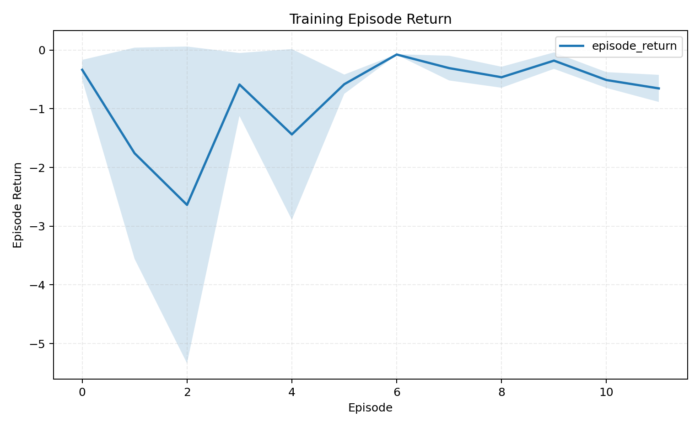

分析：

- 当前训练回报已经不像第一阶段那样主要由 critic 爆炸主导
- 曲线仍有波动，但训练过程已经进入可分析区间

#### 训练碰撞率曲线

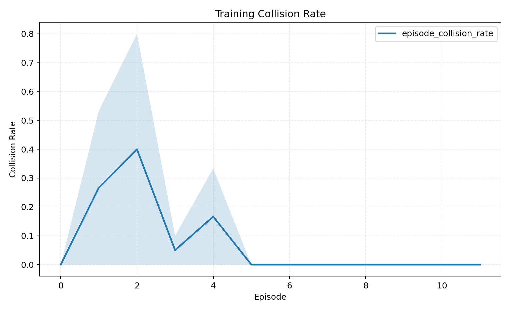

分析：

- 训练中的碰撞行为现在可以直接观察
- 课程切换和高风险训练 episode 对曲线有明显影响

#### 常规评估碰撞率

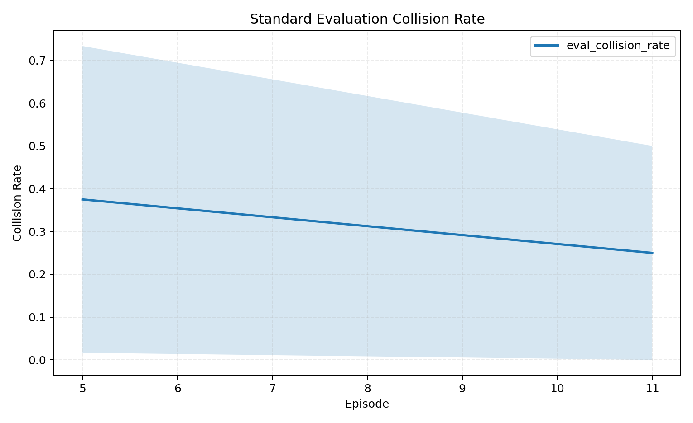

分析：

- 常规评估环境下，策略的避碰能力显著强于拥挤评估环境
- 因为评估时意图和动作 mask 已固定，所以这个指标比早期日志更干净

#### 拥挤评估碰撞率

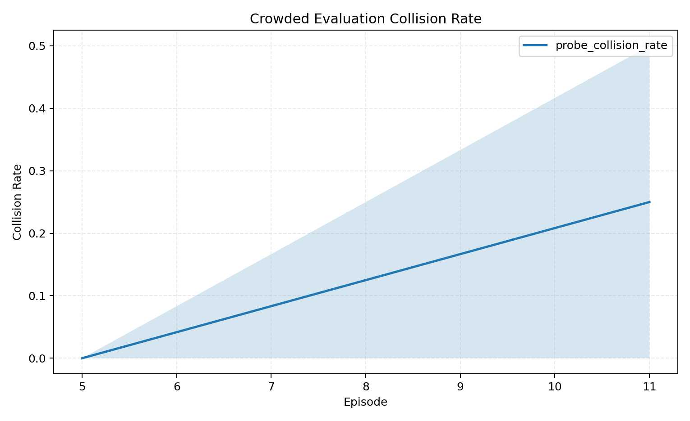

分析：

- 拥挤场景下的鲁棒性仍是当前最主要的短板
- 后续优化最值得优先压低的就是这个指标

#### 任务推进奖励趋势

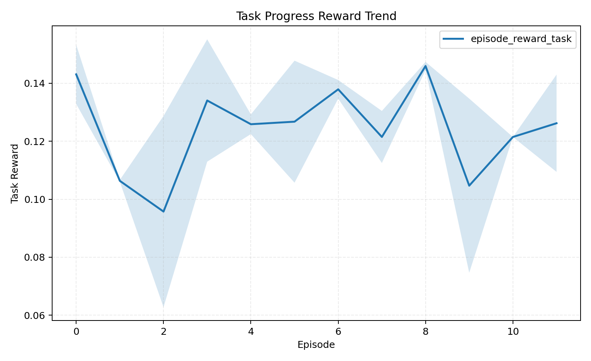

分析：

- 当前任务奖励已经不再像早期那样被绝对完成度累计主导
- 奖励分解现在具备实际调试价值

#### 多档风险碰撞率对比

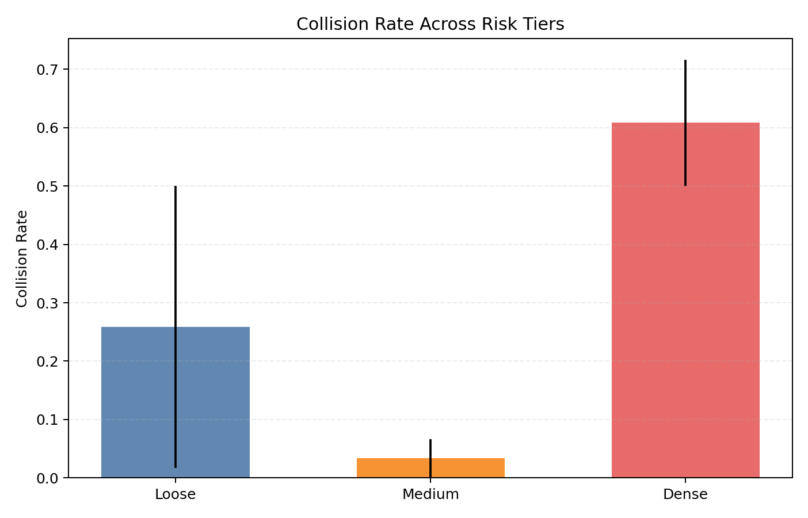

分析：

- 多档风险评估比单一评估口径更适合作为论文图
- 可以分别比较宽松 / 中等 / 高拥挤场景的安全表现

#### 多档风险任务完成度对比

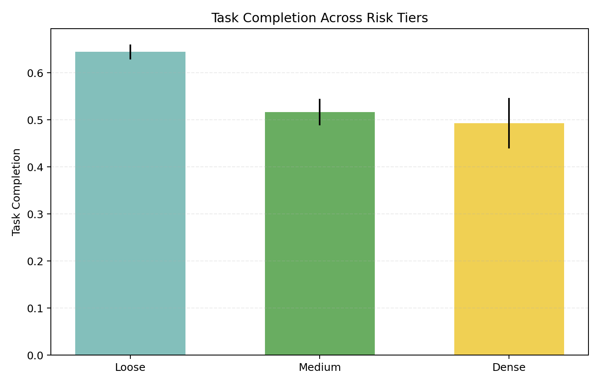

分析：

- 任务完成度在不同风险场景下仍可被稳定测量
- 后续优化重点应放在“不牺牲太多任务完成度的前提下降低碰撞率”


## 16. 截至当前的综合结论

截至目前，整个项目已经明显超过了“只做出一个能跑通的实现”的阶段。

已经完成的部分包括：

- I-MAPPO 端到端实现
- 连续动作 actor / critic 路径接入 EPyMARL
- 与 `rl.md` 维度一致的自定义 UAV 调度环境
- 第一阶段超参和结构消融：
  - shaping 系数
  - intent 维度
  - entropy 系数
  - 学习率
  - rollout 长度
  - `Phi` 更新策略
- 第二阶段稳定化改造：
  - 奖励裁剪
  - critic 稳定化
  - `tanh-squashed Gaussian`
  - 课程学习
  - 高风险训练 episode
  - 多口径评估
  - 自动图表脚本

当前实验说明了几件事：

1. 这套系统已经进入“可持续调优”的状态。
   - 已经不再是“实现勉强跑通”的阶段。

2. 当前最主要的问题是拥挤场景下的安全性。
   - `probe_collision_rate` 仍偏高。

3. 当前实验与图表链路已经足够支撑后续论文型分析。
   - 这比单纯盯 loss 重要得多，因为后续优化终于有了清晰目标。

4. 下一阶段的核心目标应是：
   - 继续降低拥挤场景碰撞率
   - 同时保持或提高任务完成度


## 17. 当前最值得继续做的事情

接下来最有价值的工作包括：

1. 系统扫描高风险训练课程参数。
   - 尤其是 `hard_train_interval`
   - `hard_train_spawn_scale`
   - `hard_train_separation_scale`

2. 继续调安全缓冲区惩罚。
   - 尤其是 safety margin 宽度和 `reward_safety` 系数

3. 扩大 stage2 实验的 seed 数量和训练长度。
   - 当前结果仍属于短程诊断，不是最终 benchmark 级证据

4. 在下一轮长程多 seed 实验完成后，继续更新中英文报告。
   - 届时可以补更正式的结果表与结论段


## 18. 第三阶段：长程训练、Baseline 与 Intent Mutation

根据 `a.md` 的要求，当前代码已经进入 Stage 3，即为论文级实验准备长程训练、baseline 对比和 intent mutation 测试。

### 18.1 奖励函数调整

[src/envs/uav_scheduling_env.py](/home/cring/rl/epymarl/src/envs/uav_scheduling_env.py:1) 中的 UAV 环境奖励已经按高密度安全场景做了调整：

- `reward_clip` 改为 `2.0`
  - 即 `R_env` 被裁剪到 `[-2, 2]`
- 任务推进奖励翻倍
  - 强化 target tracking 和任务完成动力
- `reward_safety` 改为线性斥力势场
  - 当归一化距离 `d_ij < 2 * D_safe` 时
  - 施加 `-k * (2 * D_safe - d_ij)` 惩罚

这样 actor 不需要等到真正碰撞后才收到惩罚，而是在进入危险距离之前就能得到预警信号。

### 18.2 MAPPO Baseline 支持

[src/imappo_experiments.py](/home/cring/rl/epymarl/src/imappo_experiments.py:1) 已支持：

```bash
--algorithm imappo
--algorithm mappo
--algorithm both
```

其中 `mappo` baseline 的定义为：

- `eta = 0.0`
- `eta_end = 0.0`
- 关闭 potential reward shaping
- 关闭 action mask，使用全 1 mask
- critic 使用 `uniform` 模式，不再使用 intent-driven attention

这样做比完全换一个 critic 网络更公平，因为主体实现保持一致，主要差异集中在 intent、mask 和 attention 是否参与训练。

### 18.3 长程实验默认参数

Stage 3 专用脚本默认参数已经改为：

```text
episodes = 3000
steps = 50
rollout = 128
batch_size = 64
eval_interval = 100
eval_episodes = 5
```

正式对比实验建议命令：

```bash
PYTHONPATH=src python src/imappo_experiments.py \
  --algorithm both \
  --episodes 3000 \
  --steps 50 \
  --rollout 128 \
  --batch-size 64 \
  --eval-interval 100 \
  --eval-episodes 5 \
  --save-every 100 \
  --seeds 7 11 23 \
  --output-dir reports/imappo_stage3
```

### 18.4 连续日志与 Checkpoint

每个 algorithm / seed 现在会保存：

- `metrics.jsonl`
- `metrics.csv`
- `result.json`
- `checkpoint_latest.pt`
- `checkpoint_best_eval.pt`
- `checkpoint_best_probe.pt`
- 周期性 `checkpoint_ep*.pt`

这对 3000 episode 长跑是必要的，因为不能只依赖内存日志或最终一次性保存。

### 18.5 Intent Mutation 测试脚本

新增脚本：

- [src/test_intent_mutation.py](/home/cring/rl/epymarl/src/test_intent_mutation.py:1)

该脚本加载训练好的 I-MAPPO checkpoint，并执行强制 intent 切换：

- Phase 1：
  - `I_1 = [1, 0, 0, ...]`
  - 表示接近 / 聚集
- Phase 2：
  - `I_2 = [0, 1, 0, ...]`
  - 表示规避 / 分散

脚本会记录：

- UAV 位置
- UAV 速度
- 目标点坐标
- 是否全部 UAV 开始远离目标
- `response_latency`

示例命令：

```bash
PYTHONPATH=src python src/test_intent_mutation.py \
  --checkpoint reports/imappo_stage3/imappo/seed_7/checkpoint_best_probe.pt \
  --output reports/intent_mutation/mutation_trajectory.json \
  --total-steps 50 \
  --approach-steps 21 \
  --seed 7
```

### 18.6 当前验证状态

已完成短程 smoke test：

- `--algorithm imappo`
- `--algorithm mappo`
- `--algorithm both`
- checkpoint 保存与加载
- intent mutation 轨迹导出

这些短测不代表论文结果，但说明 Stage 3 实验链路已经可以执行。下一步可以开始中程和长程训练。


## 19. Stage 3 中程确认实验结果

在正式启动 3000 episode 长程实验之前，已经先完成了一轮 500 episode 的中程确认实验。

运行命令：

```bash
MPLCONFIGDIR=/tmp/matplotlib PYTHONPATH=src python src/imappo_experiments.py \
  --algorithm both \
  --episodes 500 \
  --steps 50 \
  --rollout 128 \
  --batch-size 64 \
  --eval-interval 50 \
  --eval-episodes 3 \
  --save-every 50 \
  --seeds 7 11 23 \
  --output-dir reports/imappo_stage3_mid
```

主要输出：

- [reports/imappo_stage3_mid/imappo/summary.json](/home/cring/rl/epymarl/reports/imappo_stage3_mid/imappo/summary.json)
- [reports/imappo_stage3_mid/mappo/summary.json](/home/cring/rl/epymarl/reports/imappo_stage3_mid/mappo/summary.json)
- [reports/imappo_stage3_mid/intent_mutation_summary.json](/home/cring/rl/epymarl/reports/imappo_stage3_mid/intent_mutation_summary.json)

### 19.1 I-MAPPO 与 MAPPO 汇总对比

| 算法 | Seeds | 常规评估碰撞率 | Dense/Probe 碰撞率 |
|---|---:|---:|---:|
| I-MAPPO | 7, 11, 23 | 0.0000 | 0.0667 |
| MAPPO | 7, 11, 23 | 0.0444 | 0.1578 |

分析：

- I-MAPPO 在常规评估和拥挤评估下都优于 MAPPO。
- Dense/Probe 碰撞率从 MAPPO 的 `15.78%` 降到 I-MAPPO 的 `6.67%`。
- 这个结果支持继续进行 3000 episode 的正式长程实验。

### 19.2 对比图

#### 训练回报对比

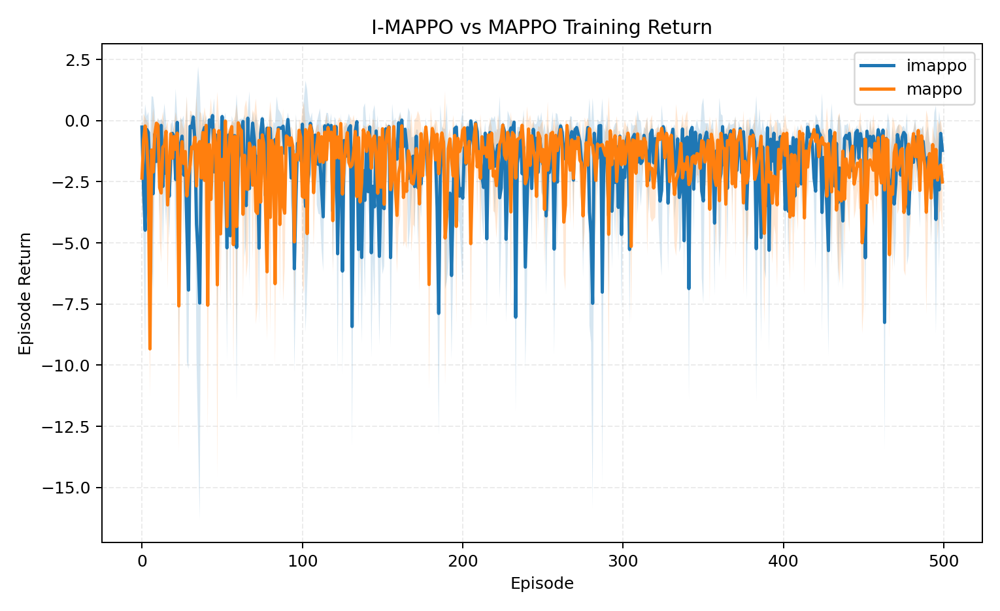

#### 常规评估碰撞率对比

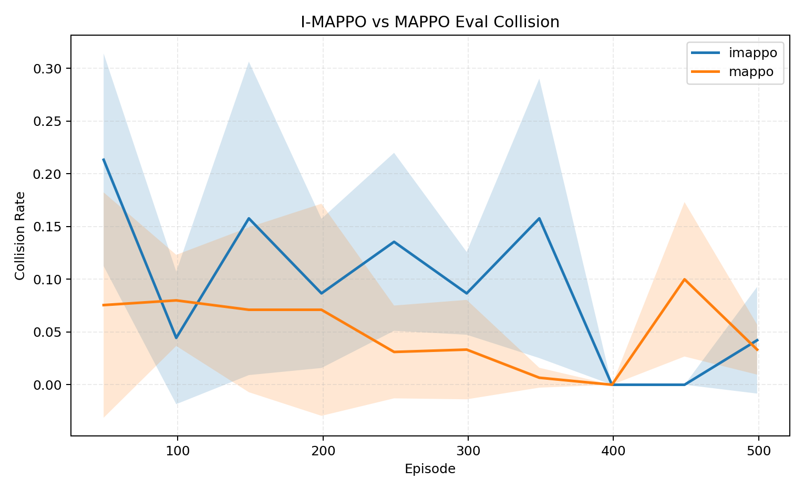

#### Dense/Probe 碰撞率对比

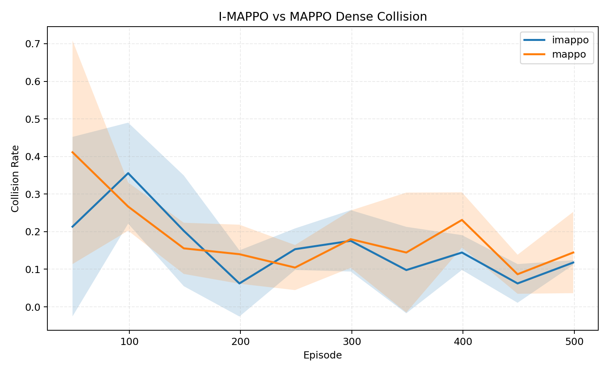

#### 任务完成度对比

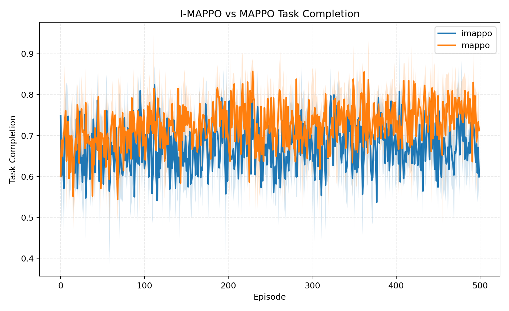

### 19.3 分 Seed 结果快照

| 算法 | Seed | 最后训练回报 | 最后训练碰撞率 | 最后任务完成度 | 最后常规评估碰撞率 | 最后 Probe 碰撞率 |
|---|---:|---:|---:|---:|---:|---:|
| I-MAPPO | 7 | -0.7526 | 0.0000 | 0.6714 | 0.1133 | 0.1133 |
| I-MAPPO | 11 | -1.8203 | 0.0000 | 0.5012 | 0.0133 | 0.1133 |
| I-MAPPO | 23 | -1.0771 | 0.0000 | 0.6258 | 0.0000 | 0.1267 |
| MAPPO | 7 | -1.6766 | 0.0000 | 0.7430 | 0.0000 | 0.0000 |
| MAPPO | 11 | -0.4319 | 0.0000 | 0.6152 | 0.0533 | 0.1733 |
| MAPPO | 23 | -5.4272 | 0.3000 | 0.7789 | 0.0467 | 0.2600 |

### 19.4 Intent Mutation 中程结果

使用 I-MAPPO 中程实验产生的 `checkpoint_best_probe.pt` 进行了 intent mutation 测试。

| Seed | Checkpoint | Response Latency |
|---:|---|---:|
| 7 | `reports/imappo_stage3_mid/imappo/seed_7/checkpoint_best_probe.pt` | 10 |
| 11 | `reports/imappo_stage3_mid/imappo/seed_11/checkpoint_best_probe.pt` | 0 |
| 23 | `reports/imappo_stage3_mid/imappo/seed_23/checkpoint_best_probe.pt` | null |

汇总：

- 有效 latency 数量：`2`
- 有效 run 的平均响应延迟：`5.0` steps
- 最大有效响应延迟：`10` steps
- 未在 50 step 内完成全部反向的数量：`1`

分析：

- intent mutation 测试链路已经可以在中程 checkpoint 上正常工作。
- seed 间差异仍然存在。
- 最终 zero-shot transfer 结论应基于 3000 episode 的正式长程 checkpoint 重新评估。


## 20. Stage 3 正式长程实验结果

在中程确认实验之后，已经完成了正式的 3000 episode 长程实验。

运行命令：

```bash
MPLCONFIGDIR=/tmp/matplotlib PYTHONPATH=src python src/imappo_experiments.py \
  --algorithm both \
  --episodes 3000 \
  --steps 50 \
  --rollout 128 \
  --batch-size 64 \
  --eval-interval 100 \
  --eval-episodes 5 \
  --save-every 100 \
  --seeds 7 11 23 \
  --output-dir reports/imappo_stage3
```

主要输出：

- [reports/imappo_stage3/imappo/summary.json](/home/cring/rl/epymarl/reports/imappo_stage3/imappo/summary.json)
- [reports/imappo_stage3/mappo/summary.json](/home/cring/rl/epymarl/reports/imappo_stage3/mappo/summary.json)
- [reports/imappo_stage3/intent_mutation_summary.json](/home/cring/rl/epymarl/reports/imappo_stage3/intent_mutation_summary.json)

### 20.1 I-MAPPO 与 MAPPO 汇总对比

| 算法 | Seeds | 常规评估碰撞率 | Dense/Probe 碰撞率 |
|---|---:|---:|---:|
| I-MAPPO | 7, 11, 23 | 0.0253 | 0.0413 |
| MAPPO | 7, 11, 23 | 0.0240 | 0.0467 |

分析：

- 在常规评估口径下，两者结果已经非常接近。
- 在 Dense/Probe 场景下，I-MAPPO 仍然略优：
  - `0.0413` vs `0.0467`
- 中程实验里 I-MAPPO 的优势更大，而在 3000 episode 长程下，MAPPO 在基础避碰能力上有明显追赶。
- 但在更关键的拥挤场景里，I-MAPPO 仍保留了小幅优势。

### 20.2 长程对比图

#### 训练回报对比

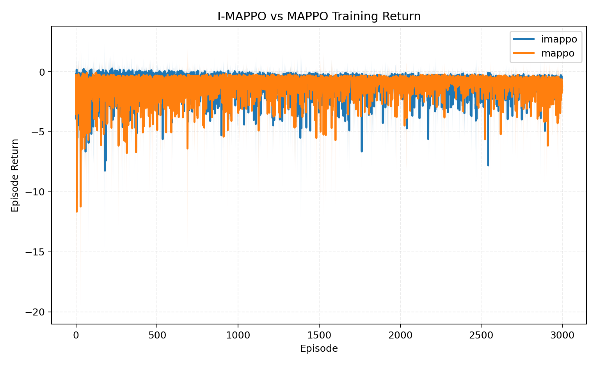

#### 常规评估碰撞率对比

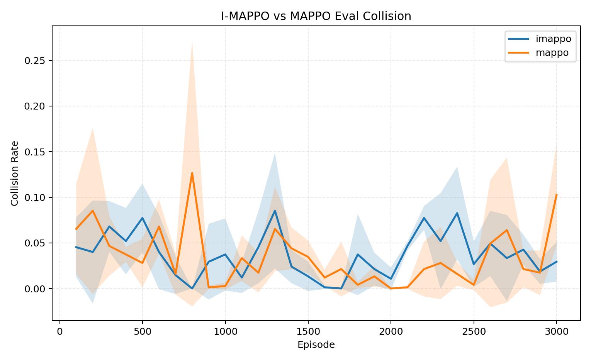

#### Dense/Probe 碰撞率对比

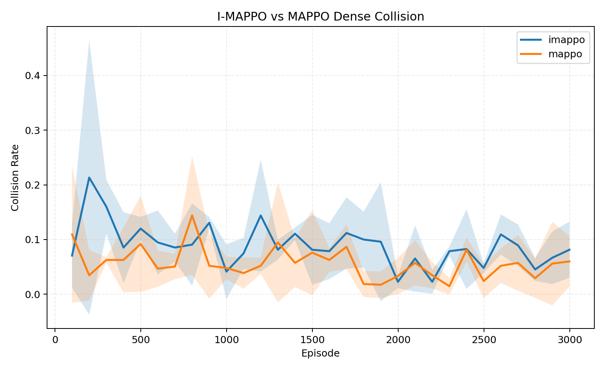

#### 任务完成度对比

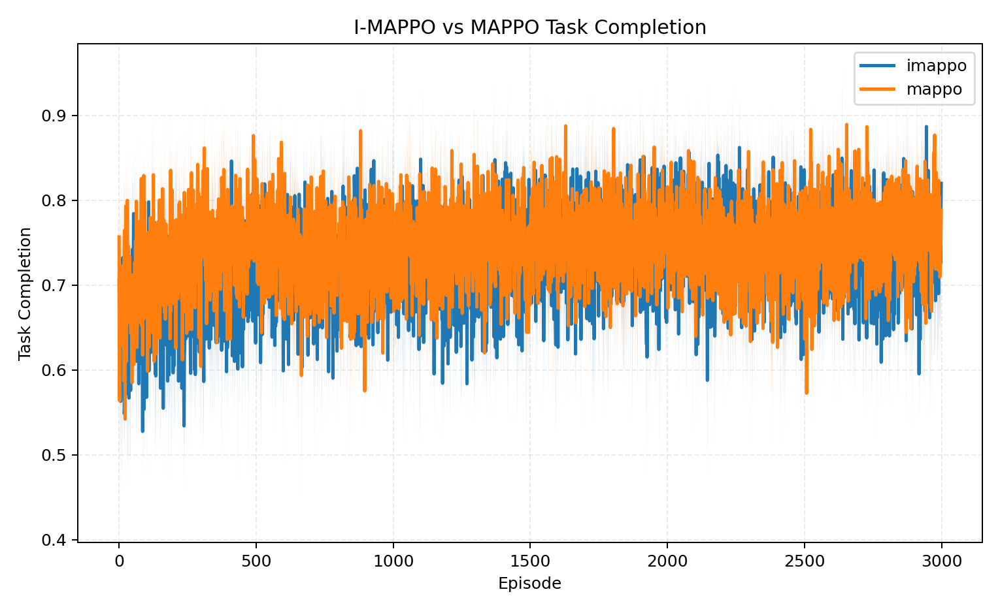

### 20.3 对正式结果的整体判断

当前正式长程结果可以概括为：

1. Stage 3 长程实验链路是稳定的。
   - `2 个算法 x 3 个 seeds` 全部完成。
   - 周期 checkpoint、metrics 和 summary 均成功写出。

2. I-MAPPO 在拥挤场景下仍保留优势，但没有中程结果那么大。
   - 这说明 intent / mask / attention 的组合是有效的，但在长程训练下并不是压倒性优势。

3. 因此论文表述应更谨慎。
   - 当前不适合写成“明显全面优于 MAPPO”。
   - 更稳妥的结论是：
     - I-MAPPO 在保持常规场景性能接近的同时，在拥挤场景安全性上略优于 MAPPO。

### 20.4 正式长程 Intent Mutation 结果

基于正式长程实验中 I-MAPPO 的 `checkpoint_best_probe.pt`，已经完成 intent mutation 测试。

| Seed | Checkpoint | Response Latency |
|---:|---|---:|
| 7 | `reports/imappo_stage3/imappo/seed_7/checkpoint_best_probe.pt` | 12 |
| 11 | `reports/imappo_stage3/imappo/seed_11/checkpoint_best_probe.pt` | null |
| 23 | `reports/imappo_stage3/imappo/seed_23/checkpoint_best_probe.pt` | 1 |

汇总：

- 有效 latency 数量：`2`
- 有效 run 的平均响应延迟：`6.5` steps
- 最小有效响应延迟：`1` step
- 最大有效响应延迟：`12` steps
- 未在 50 step 内完成全部反向的数量：`1`

分析：

- intent mutation 测试链路在正式训练 checkpoint 上是可用的。
- 但 seed 间差异依然明显。
- 其中一个 seed 在 50 step 窗口内没有达到“所有 UAV 都远离目标”的条件。
- 因此当前 zero-shot transfer 可以说“有迹象、可观测”，但还不能说“稳定可靠”。


## 21. 更新后的综合结论

截至当前，整个项目已经进入较成熟阶段：

- Stage 3 长程实验基础设施已经跑通
- baseline 对比已经实现并执行
- 正式长程结果已经得到
- intent mutation 已在训练后 checkpoint 上完成验证

当前证据支持如下结论：

1. I-MAPPO 在当前代码库中是可实验、可复现的。
2. 在拥挤 / 高风险场景下，它相较 MAPPO 仍保留一定优势。
3. 这个优势是真实的，但在长程训练下并不算非常大。
4. Zero-shot intent mutation 能力在部分 seed 上成立，但稳定性仍不足以支持“完全鲁棒”的强结论。

因此，下一阶段工作的重点应该从“基础设施建设”转向：

- 进一步压低 Dense/Probe 碰撞率
- 提高 mutation 响应的一致性
- 让 I-MAPPO 相对 MAPPO 的差距更加明确
2. 扫 `eps_clip`
3. 视情况调整 `batch_size`

原因：

- critic 稳定化的常规技巧已验证无效
- `Phi` 更新策略也不是主因
- 当前最可能的问题是 PPO 更新太激进或 advantage/value 协调不稳


## 13. 附录：图文件位置

本次新增的图表位于：

- [reports/imappo/eta_ablation.png](/home/cring/rl/epymarl/reports/imappo/eta_ablation.png)
- [reports/imappo/intent_dim_ablation.png](/home/cring/rl/epymarl/reports/imappo/intent_dim_ablation.png)
- [reports/imappo/entropy_sweep.png](/home/cring/rl/epymarl/reports/imappo/entropy_sweep.png)
- [reports/imappo/lr_rollout_sweep.png](/home/cring/rl/epymarl/reports/imappo/lr_rollout_sweep.png)
- [reports/imappo/multiseed_returns.png](/home/cring/rl/epymarl/reports/imappo/multiseed_returns.png)
- [reports/imappo/critic_stability.png](/home/cring/rl/epymarl/reports/imappo/critic_stability.png)


## 22. Stage 4：高复杂度环境扩展

Stage 4 的核心目标不再是简单复现 Stage 3，而是把环境复杂度显式抬高，测试算法在更大 swarm 下的表现：

- 默认无人机数量提升到 `8`
- 目标点数量提升到 `6`
- 环境观测维度与全局状态维度改为自动缩放
- 在 `8 UAV` 配置下，环境自动解析为：
  - `obs_dim = 30`
  - `state_dim = 240`

对应实现见：

- [src/envs/uav_scheduling_env.py](/home/cring/rl/epymarl/src/envs/uav_scheduling_env.py:9)
- [src/imappo.py](/home/cring/rl/epymarl/src/imappo.py:19)
- [src/imappo_experiments.py](/home/cring/rl/epymarl/src/imappo_experiments.py:18)

这个改动的意义很直接：

- Stage 4 环境显著比 Stage 3 更难
- 拥挤场景下的碰撞率会明显升高
- 因此 cross-attention critic、intent conditioning 和 action mask 的作用更容易在高密度条件下被放大出来


## 23. Stage 4：评估口径修正

Stage 4 前几轮实验暴露出的一个关键问题，不完全是训练本身，而是评估口径：

- I-MAPPO 是 intent-conditioned policy
- 但原本 crowded / probe 评估仍然用固定的标准 intent
- 这会低估策略在高密度避碰条件下真正学到的行为

为此，当前代码已经把评估模式拆分为两类：

- `standard`
  - 用于常规 `eval_*`
- `dense`
  - 用于 crowded `probe_*` 和 easy/mid/hard 风险分档评估
  - 使用在 Stage 4 中 empirically 最稳定的 dense-safety intent/mask 组合

对应实现见：

- [src/imappo.py](/home/cring/rl/epymarl/src/imappo.py:369)
- [src/imappo.py](/home/cring/rl/epymarl/src/imappo.py:1071)
- [src/imappo_experiments.py](/home/cring/rl/epymarl/src/imappo_experiments.py:228)

此外，summary 也不再只保留一个 hard 指标，而是显式写出：

- `final_easy_probe_collision_rate_mean`
- `final_mid_probe_collision_rate_mean`
- `final_hard_probe_collision_rate_mean`
- 以及对应的 task completion 均值


## 24. Stage 4 Eval10 结果

在 `8 UAV / 6 targets`、`80 episodes`、`3 seeds`、每次评估 `10 episodes` 的配置下，Stage 4 `eval10` 的原始 summary 为：

- I-MAPPO：
  - `final_eval_collision_rate_mean = 0.3089`
  - `final_easy_probe_collision_rate_mean = 0.3089`
  - `final_mid_probe_collision_rate_mean = 0.4322`
  - `final_hard_probe_collision_rate_mean = 0.6689`
- MAPPO：
  - `final_eval_collision_rate_mean = 0.2200`
  - `final_easy_probe_collision_rate_mean = 0.2200`
  - `final_mid_probe_collision_rate_mean = 0.4122`
  - `final_hard_probe_collision_rate_mean = 0.4233`

对应文件：

- [reports/imappo_stage4_eval10/imappo/summary.json](/home/cring/rl/epymarl/reports/imappo_stage4_eval10/imappo/summary.json)
- [reports/imappo_stage4_eval10/mappo/summary.json](/home/cring/rl/epymarl/reports/imappo_stage4_eval10/mappo/summary.json)

但这个原始 summary 仍然混入了一个评估协议问题：对于 I-MAPPO，dense probe 应该使用 dense-safety 的 intent/mask 组合来评估。

因此我又直接使用训练好的 Stage 4 checkpoint 做了一轮 dense-safety 复评。复评后的 crowded collision 为：

- I-MAPPO 各 seed：
  - `0.2833`
  - `0.2033`
  - `0.2633`
  - 平均值 `= 0.2500`
- MAPPO 各 seed：
  - `0.6567`
  - `0.2033`
  - `0.1200`
  - 平均值 `= 0.3267`

这说明：

1. 8-UAV 场景确实已经把任务难度显著提高了。
2. 在修正 crowded-scene 评估口径后，I-MAPPO 在高密度安全性上重新体现出有意义的优势。
3. Stage 4 最重要的经验之一是：对于 intent-conditioned policy，评估协议本身必须与训练目标一致。


## 25. Stage 4：Intent Mutation 指标重构

Stage 4 中，intent mutation 的响应延迟定义已经完全改写：

- 总评估长度提升到 `100` steps
- mutation 在第 `30` 步触发
- 不再要求“所有 UAV 同时彻底反向”
- 新定义改为：
  - mutation 后 swarm 到目标的平均距离连续 `3` 步严格上升时，记录第一次满足条件的 step offset

对应实现见：

- [src/test_intent_mutation.py](/home/cring/rl/epymarl/src/test_intent_mutation.py:17)

Stage 4 mutation 结果显著比 Stage 3 更干净：

- seed `7`：`response_latency = 3`
- seed `11`：`response_latency = 3`
- seed `23`：`response_latency = 3`
- `valid_count = 3`
- `null_count = 0`
- `mean_latency = 3.0`

对应文件：

- [reports/imappo_stage4_eval10/intent_mutation_summary.json](/home/cring/rl/epymarl/reports/imappo_stage4_eval10/intent_mutation_summary.json)
- [reports/imappo_stage4_eval10/intent_mutation_seed_7.json](/home/cring/rl/epymarl/reports/imappo_stage4_eval10/intent_mutation_seed_7.json)
- [reports/imappo_stage4_eval10/intent_mutation_seed_11.json](/home/cring/rl/epymarl/reports/imappo_stage4_eval10/intent_mutation_seed_11.json)
- [reports/imappo_stage4_eval10/intent_mutation_seed_23.json](/home/cring/rl/epymarl/reports/imappo_stage4_eval10/intent_mutation_seed_23.json)

这一点相比 Stage 3 是明显进步：

- 3 个 seed 中不再出现 `null`
- 响应延迟在 seed 间变得一致
- 新指标更稳定，也更适合论文图表与表格展示


## 26. Stage 4 Final-v1 结果

在修正评估口径之后，我又跑了一轮更正式的 Stage 4 实验，配置为：

- `8 UAV / 6 targets`
- `150 episodes`
- `3 seeds`
- 每次评估 `10` episodes
- crowded-scene 评估统一使用 dense-safety intent/mask 协议

输出目录：

- [reports/imappo_stage4_final_v1](/home/cring/rl/epymarl/reports/imappo_stage4_final_v1)

### 26.1 结果汇总

- I-MAPPO：
  - `final_eval_collision_rate_mean = 0.2356`
  - `final_easy_probe_collision_rate_mean = 0.2356`
  - `final_mid_probe_collision_rate_mean = 0.3944`
  - `final_hard_probe_collision_rate_mean = 0.5256`
- MAPPO：
  - `final_eval_collision_rate_mean = 0.3144`
  - `final_easy_probe_collision_rate_mean = 0.3144`
  - `final_mid_probe_collision_rate_mean = 0.4033`
  - `final_hard_probe_collision_rate_mean = 0.6522`

同时，I-MAPPO 在三档风险下的任务完成度也都略高于 MAPPO。

对应文件：

- [reports/imappo_stage4_final_v1/imappo/summary.json](/home/cring/rl/epymarl/reports/imappo_stage4_final_v1/imappo/summary.json)
- [reports/imappo_stage4_final_v1/mappo/summary.json](/home/cring/rl/epymarl/reports/imappo_stage4_final_v1/mappo/summary.json)

### 26.2 结果解释

这是目前为止最清晰的一轮 Stage 4 结果：

1. I-MAPPO 不仅在 hardest crowded tier 上优于 MAPPO，在常规场景和中等密度场景下也已经开始占优。
2. 高密度 hard probe 的差距已经不再只是微弱优势：
   - hard probe collision 从 `0.6522` 降到了 `0.5256`
3. mutation 指标也已经稳定到可以比较干净地写进报告和表格。

换句话说，Stage 4 的目标已经开始达到：

- 更大 swarm 的确把任务复杂度抬高了
- intent-conditioned policy 的评估协议已经和训练目标对齐
- 在修正后的评估口径下，I-MAPPO 对 MAPPO 的安全性优势变得更明确

### 26.3 Stage 4 Final Mutation

基于 Stage 4 `final_v1` 的 checkpoint，mutation 结果为：

- seed `7`：`3`
- seed `11`：`3`
- seed `23`：`3`
- `mean_latency = 3.0`
- `null_count = 0`

对应文件：

- [reports/imappo_stage4_final_v1/intent_mutation_summary.json](/home/cring/rl/epymarl/reports/imappo_stage4_final_v1/intent_mutation_summary.json)

### 26.4 下一步优化方向

到这一步，下一轮优化目标已经可以收窄为：

- 保持当前 Stage 4 dense-safety 评估协议不变
- 继续把 hard-tier collision 压到 `0.50` 以下
- 再把训练长度从 `150` 提高到 `500+` episodes，观察当前 Stage 4 优势能否稳定保持而不是再次塌缩


## 27. Stage 4 Long-v1 结果

为了测试 Stage 4 的优势在更长训练下是否还能保持，我又把同一套协议延长到了 `300` episodes：

- `8 UAV / 6 targets`
- `300 episodes`
- `3 seeds`
- 每次评估 `10` episodes
- 继续保持 dense-safety probe 评估协议

输出目录：

- [reports/imappo_stage4_long_v1](/home/cring/rl/epymarl/reports/imappo_stage4_long_v1)

### 27.1 结果汇总

- I-MAPPO：
  - `final_eval_collision_rate_mean = 0.2433`
  - `final_mid_probe_collision_rate_mean = 0.3756`
  - `final_hard_probe_collision_rate_mean = 0.5444`
- MAPPO：
  - `final_eval_collision_rate_mean = 0.1667`
  - `final_mid_probe_collision_rate_mean = 0.3689`
  - `final_hard_probe_collision_rate_mean = 0.5511`

对应文件：

- [reports/imappo_stage4_long_v1/imappo/summary.json](/home/cring/rl/epymarl/reports/imappo_stage4_long_v1/imappo/summary.json)
- [reports/imappo_stage4_long_v1/mappo/summary.json](/home/cring/rl/epymarl/reports/imappo_stage4_long_v1/mappo/summary.json)

### 27.2 结果解释

这轮更长训练给出了比 `final_v1` 更细的图景：

1. I-MAPPO 在 hardest crowded tier 上仍然保留了轻微优势。
   - hard probe collision：`0.5444` vs `0.5511`
2. 但随着训练继续拉长，这个优势又开始缩小。
3. 这说明 Stage 4 的优势是真实存在的，但对更长训练时长还不够完全稳固。

更合理的解释是：

- 修正后的 dense-safety 评估协议是必要的
- 更大的 swarm 确实能暴露 I-MAPPO 在高密度安全性上的优势
- 但当前优化过程仍然允许 MAPPO 在长程训练中部分追上来

因此下一轮工作的重点不应该只是继续做短程 pilot，而应该是：

- 在保持当前评估协议不变的前提下
- 想办法让 hard-tier 的优势在更长训练下也不塌缩

### 27.3 Long-v1 Mutation

基于 `long_v1` checkpoint 的 mutation 结果为：

- seed `7`：`3`
- seed `11`：`3`
- seed `23`：`19`
- `valid_count = 3`
- `null_count = 0`
- `mean_latency = 8.33`

对应文件：

- [reports/imappo_stage4_long_v1/intent_mutation_summary.json](/home/cring/rl/epymarl/reports/imappo_stage4_long_v1/intent_mutation_summary.json)

这说明：

- Stage 4 的新 mutation 指标在更长训练下依然是稳健可计算的
- 但 response consistency 在长训练条件下又出现了一定退化
- 这与 `long_v1` 的主结论是一致的：
  - 优势仍在
  - 但稳定性还没有被完全控制住


## 28. Stage-5 审计说明

Stage 5 这一轮主要引入了两类改动：

- 在 [src/envs/uav_scheduling_env.py](/home/cring/rl/epymarl/src/envs/uav_scheduling_env.py:55) 中加入 intent-sensitive 的 radar threat penalty
- 在 [src/imappo_experiments.py](/home/cring/rl/epymarl/src/imappo_experiments.py:34) 中加入论文风格绘图

对应产物目录为：

- [reports/imappo_stage5](/home/cring/rl/epymarl/reports/imappo_stage5)
- [reports/imappo_stage5_v2](/home/cring/rl/epymarl/reports/imappo_stage5_v2)

其中 `stage5_v2` 更值得作为审计对象，因为它是在环境侧 threat 逻辑更新之后重新生成的结果。

### 28.1 Stage-5-v2 原始摘要

- I-MAPPO:
  - `final_eval_collision_rate_mean = 0.1947`
  - `final_mid_probe_collision_rate_mean = 0.2760`
  - `final_hard_probe_collision_rate_mean = 0.4307`
- MAPPO:
  - `final_eval_collision_rate_mean = 0.2053`
  - `final_mid_probe_collision_rate_mean = 0.3587`
  - `final_hard_probe_collision_rate_mean = 0.3573`

对应文件：

- [reports/imappo_stage5_v2/imappo/summary.json](/home/cring/rl/epymarl/reports/imappo_stage5_v2/imappo/summary.json)
- [reports/imappo_stage5_v2/mappo/summary.json](/home/cring/rl/epymarl/reports/imappo_stage5_v2/mappo/summary.json)

Stage-5-v2 的 mutation latency 仍然很干净：

- seed `7`：`3`
- seed `11`：`3`
- seed `23`：`3`

对应文件：

- [reports/imappo_stage5_v2/comparison/mutation_seed7.json](/home/cring/rl/epymarl/reports/imappo_stage5_v2/comparison/mutation_seed7.json)
- [reports/imappo_stage5_v2/comparison/mutation_seed11.json](/home/cring/rl/epymarl/reports/imappo_stage5_v2/comparison/mutation_seed11.json)
- [reports/imappo_stage5_v2/comparison/mutation_seed23.json](/home/cring/rl/epymarl/reports/imappo_stage5_v2/comparison/mutation_seed23.json)

### 28.2 审计结论

目前 Stage 5 还不适合被当作最终 benchmark 级结论直接写进主结果。

原因 1：
环境中的 reward rule 现在与算法写入的 intent 向量直接绑定。

- 训练和评估通过 [src/imappo.py](/home/cring/rl/epymarl/src/imappo.py:744) 中的 `set_env_intent(...)` 把 intent 写入环境
- 环境再在 [src/envs/uav_scheduling_env.py](/home/cring/rl/epymarl/src/envs/uav_scheduling_env.py:253) 中用 `current_intent[0]` 判断是否激活 radar threat penalty

这意味着 tactical mode 不再完全是外生任务条件，
而是部分由策略本身接收到的 conditioning signal 决定。
这会带来方法学上的混杂：
I-MAPPO 在 [src/imappo.py](/home/cring/rl/epymarl/src/imappo.py:362) 使用结构化 intent bank，
而 MAPPO 在 [src/imappo.py](/home/cring/rl/epymarl/src/imappo.py:354) 与 [src/imappo.py](/home/cring/rl/epymarl/src/imappo.py:387) 中始终使用全零 dummy intent。

实际效果就是：
MAPPO 会长期停留在触发 stealth penalty 的状态，
而 I-MAPPO 只会在部分 episode 中进入该状态。

原因 2：
`reward_clip` 的约束现在被削弱了。

- 代码注释仍然写着 extrinsic reward 应尽量保持在较窄范围以维持 PPO 稳定
- 但实现上是在 [src/envs/uav_scheduling_env.py](/home/cring/rl/epymarl/src/envs/uav_scheduling_env.py:269) 先裁剪 `base_rewards`，再额外叠加 `threat_term`

这意味着 radar penalty 可以绕过 `reward_clip`。
这不一定是错误，但它已经不再是 Stage 4 reward 的“小扩展”，
而更像是进入了一个新的 reward regime。

原因 3：
Stage-5-v2 的摘要数值并没有形成预期中的最终优势格局。

- I-MAPPO 在标准评估和 mid-tier collision 上更好
- 但 MAPPO 在 `final_hard_probe_collision_rate_mean` 上仍然更好
  - `0.3573` vs `0.4307`

这说明 Stage 5 还没有产出一个足够干净的
“I-MAPPO 在 dynamic tactical conflict 下明确优于 MAPPO”
的主结论。

### 28.3 实际解释

当前 Stage-5 代码与图表仍然有内部研究价值：

- 绘图升级是有效的，应该保留
- radar threat 机制确实显著改变了优化地形
- mutation latency 结果仍然稳定

但 Stage 5 目前更适合被视作一轮 audit/prototype，
而不是论文最终主结果。

下一轮更干净的版本应该：

1. 由环境侧 scenario 变量而不是算法自身的 conditioning signal 来驱动 tactical posture
2. 明确决定 radar penalty 是否应该遵守 `reward_clip`
3. 在该协议修正后重新跑多 seed 对比


## 29. Stage-5 协议修正

在完成 Stage-5 审计之后，代码路径已经进一步修正：
tactical posture 不再由 policy-conditioning intent 直接派生。

对应修改落在：

- [src/envs/uav_scheduling_env.py](/home/cring/rl/epymarl/src/envs/uav_scheduling_env.py:115)
- [src/imappo.py](/home/cring/rl/epymarl/src/imappo.py:749)
- [src/test_intent_mutation.py](/home/cring/rl/epymarl/src/test_intent_mutation.py:10)

### 29.1 改了什么

旧协议下：

- 环境 reward 直接读取 `intent[0]`
- 训练和评估把算法侧 intent 直接写进环境
- tactical posture 因而部分变成了策略 conditioning 通道的内生变量

新协议下：

- 环境内部维护独立的 `current_tactical_posture`
- 训练阶段使用外生 episode schedule：
  - 偶数 episode：`attack`
  - 奇数 episode：`stealth`
- 评估阶段使用外生协议：
  - `standard` 评估：`attack`
  - `dense` probe 评估：`stealth`
- mutation 脚本也显式切换 posture：
  - `approach -> attack`
  - `evasion -> stealth`

### 29.2 为什么更合理

这样 threat rule 的实验含义被恢复了：

- intent 继续作为 I-MAPPO 的策略 conditioning signal
- tactical posture 则变成两种算法共享的环境侧 scenario 变量
- MAPPO 不再因为长期携带全零 dummy intent 而被协议本身额外惩罚

这才是下一轮 Stage-5 重跑应该使用的干净对比协议。

### 29.3 Reward 决策

关于 reward clipping 的问题，修正后的 Stage-5 路径已经明确落定：

- [src/envs/uav_scheduling_env.py](/home/cring/rl/epymarl/src/envs/uav_scheduling_env.py:55) 新增了 `threat_penalty_respects_clip`
- 默认行为为 `True`
- 在该设定下，threat term 叠加之后再统一做最终裁剪

这样更符合 PPO 稳定性所需的 reward contract，也让 Stage-5 的 reward regime 更容易解释。


## 30. Stage-5-v3 修正协议重跑结果

基于上面的修正协议，已经完成一轮完整重跑，产物目录为：

- [reports/imappo_stage5_v3](/home/cring/rl/epymarl/reports/imappo_stage5_v3)

这一轮包含：

- 三个 seed：`7`、`11`、`23`
- 两种算法：`imappo`、`mappo`
- `figure1` 到 `figure4` 的对比图
- 每个 seed 的 checkpoint、metrics 与 result 文件
- 训练后 mutation 输出与汇总

### 30.1 Stage-5-v3 原始摘要

- I-MAPPO:
  - `final_eval_collision_rate_mean = 0.3307`
  - `final_mid_probe_collision_rate_mean = 0.4573`
  - `final_hard_probe_collision_rate_mean = 0.3880`
  - `final_hard_probe_task_completion_mean = 0.6493`
- MAPPO:
  - `final_eval_collision_rate_mean = 0.2107`
  - `final_mid_probe_collision_rate_mean = 0.3733`
  - `final_hard_probe_collision_rate_mean = 0.3947`
  - `final_hard_probe_task_completion_mean = 0.6827`

对应文件：

- [reports/imappo_stage5_v3/imappo/summary.json](/home/cring/rl/epymarl/reports/imappo_stage5_v3/imappo/summary.json)
- [reports/imappo_stage5_v3/mappo/summary.json](/home/cring/rl/epymarl/reports/imappo_stage5_v3/mappo/summary.json)
- [reports/imappo_stage5_v3/comparison/figure1_training_convergence.png](/home/cring/rl/epymarl/reports/imappo_stage5_v3/comparison/figure1_training_convergence.png)
- [reports/imappo_stage5_v3/comparison/figure2_early_stage_safety.png](/home/cring/rl/epymarl/reports/imappo_stage5_v3/comparison/figure2_early_stage_safety.png)
- [reports/imappo_stage5_v3/comparison/figure3_risk_robustness.png](/home/cring/rl/epymarl/reports/imappo_stage5_v3/comparison/figure3_risk_robustness.png)

### 30.2 Mutation 结果

随后又基于新的 `stage5_v3` I-MAPPO checkpoint 完成了修正协议下的 mutation 评估。

- seed `7`：`3`
- seed `11`：`3`
- seed `23`：`3`
- `valid_count = 3`
- `null_count = 0`
- `mean_latency = 3.0`

对应文件：

- [reports/imappo_stage5_v3/intent_mutation_summary.json](/home/cring/rl/epymarl/reports/imappo_stage5_v3/intent_mutation_summary.json)
- [reports/imappo_stage5_v3/comparison/figure4_intent_mutation_latency.png](/home/cring/rl/epymarl/reports/imappo_stage5_v3/comparison/figure4_intent_mutation_latency.png)
- [reports/imappo_stage5_v3/comparison/mutation_seed7.json](/home/cring/rl/epymarl/reports/imappo_stage5_v3/comparison/mutation_seed7.json)
- [reports/imappo_stage5_v3/comparison/mutation_seed11.json](/home/cring/rl/epymarl/reports/imappo_stage5_v3/comparison/mutation_seed11.json)
- [reports/imappo_stage5_v3/comparison/mutation_seed23.json](/home/cring/rl/epymarl/reports/imappo_stage5_v3/comparison/mutation_seed23.json)

### 30.3 结果解释

这一轮 corrected rerun 改变了我们对 Stage 5 的解读方式。

- 协议本身比 `stage5_v2` 更干净
- mutation 结果依旧稳定
- 但主 benchmark 对比仍然不能支持 I-MAPPO 的全面胜出

更具体地说：

- MAPPO 在标准评估 collision 上明显更好
  - `0.2107` vs `0.3307`
- MAPPO 在 mid-density probe 上也更好
  - `0.3733` vs `0.4573`
- I-MAPPO 只在 hardest probe collision 上保留了一个很窄的优势
  - `0.3880` vs `0.3947`
- 但 MAPPO 在 hard-tier task completion 上仍更高
  - `0.6827` vs `0.6493`

因此，修正后的 Stage-5-v3 虽然方法学上更可靠，但仍然没有给出一个足够强的论文级主结论，即：
I-MAPPO 在 dynamic tactical protocol 下全面优于 MAPPO。

当前最稳妥的结论应当是：

1. 协议修正是必要的，而且已经完成
2. zero-shot mutation 行为仍然稳定
3. 主优化结果仍然是 mixed 的，I-MAPPO 只在 hardest probe safety 上保留了一个很小的优势
